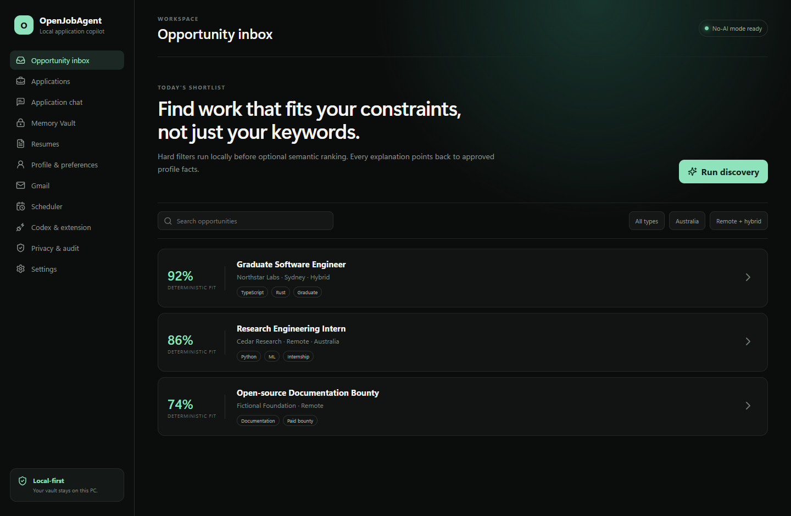

# OpenJobAgent

OpenJobAgent is a Windows-first, local job-search and application copilot. A Tauri desktop app, Chrome/Edge side-panel extension and authenticated Native Messaging host work together without requiring an OpenAI API key.



## What works

- Portable Memory Vault creation with per-fact status, provenance, sensitivity and allowed uses.
- Markdown and text resume import. Originals can be copied or left in reference-only mode.
- Grounded answers that use only `verified` and `user_asserted` facts. Missing facts produce a focused follow-up question.
- Explicit `use_once`, `save_fact`, `save_story` and `cancel` clarification decisions.
- Chrome/Edge MV3 field extraction, evidence display and safe field filling across tested Greenhouse-style, Lever-style and generic fixtures.
- HMAC-authenticated, length-prefixed Native Messaging with extension-ID checks, a 1 MiB limit and strict message schemas.
- SQLite operational tables and migrations for opportunities, applications, form snapshots, sessions, chat, drafts, Gmail links, scheduler runs, audit events and adapter health.
- Opportunity normalization, duplicate fingerprints and deterministic hard filters.
- A Gmail connector contract and fixture-backed mock classifier.
- No-AI mode and a Codex SDK provider with status checks, persistent thread IDs, continuation, cancellation and failure handling.
- A Tauri 2 desktop shell with the required work areas and explicit local/external/approval states.

## Current boundaries

Live Gmail OAuth is not configured in this repository. PDF and DOCX import return clear adapter errors; Markdown and text import are tested. The generic form engine never submits applications, and no live ATS adapter or auto-submit adapter is enabled. Codex generation needs a local Codex installation signed in through its supported login flow.

[Current limitations](docs/LIMITATIONS.md) lists every mocked, experimental and blocked path.

## Quick start on Windows

Prerequisites: Node.js 20.17 or newer, pnpm 11, Rust stable with the MSVC target, WebView2 and Chrome or Edge.

```powershell
pnpm install
pnpm check
pnpm tauri dev
```

The unpacked extension is built at `apps/extension/dist`. The native host is built at `target/debug/open-job-agent-native-host.exe` during checks.

For the full setup, see [Installation](docs/INSTALLATION.md), [Windows development](docs/WINDOWS_DEVELOPMENT.md), [extension setup](docs/EXTENSION_INSTALLATION.md) and [Codex login](docs/CODEX_LOGIN.md).

## Repository map

```text
apps/desktop           Tauri 2 and React desktop app
apps/extension         Chrome/Edge MV3 side panel and content scripts
apps/native-host       Rust Native Messaging process
packages/shared        Zod schemas and provider contracts
packages/memory-vault  Portable facts, resume import and targeted retrieval
packages/answer-engine Grounding and multi-turn clarification
packages/job-engine    Sources, normalization, filters and scheduler
packages/form-engine   Field extraction and safe filling
packages/provider-*    Codex and deterministic No-AI providers
packages/integrations  Gmail abstraction and development mock
crates/*               SQLite, secure storage and native protocol
examples/              Fictional example Vault
```

## Safety model

Page content and job descriptions are untrusted data. The Codex provider places them inside an explicit untrusted boundary and sends only targeted approved context. Generic filling skips sensitive demographic fields and never clicks final submit. The native host accepts no shell command, URL or extension-supplied path.

See [Privacy](docs/PRIVACY.md), [Security](docs/SECURITY.md), [Threat model](docs/THREAT_MODEL.md) and [Data flow](docs/DATA_FLOW.md).

## Verification

`docs/VERIFICATION.md` records commands, platform and concrete results from the latest local run. Treat that file as authoritative when test counts or artifacts change.

## License

OpenJobAgent uses the [MIT License](LICENSE). MIT keeps reuse simple for an early open-source desktop tool while preserving the copyright and warranty notice. Dependencies retain their own licences.

## Contributing

[CONTRIBUTING.md](CONTRIBUTING.md) covers local checks, fixture rules and safety requirements. Participation is governed by the [Code of Conduct](CODE_OF_CONDUCT.md).
